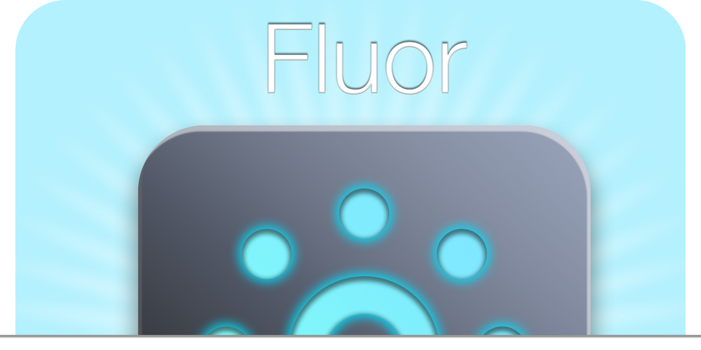
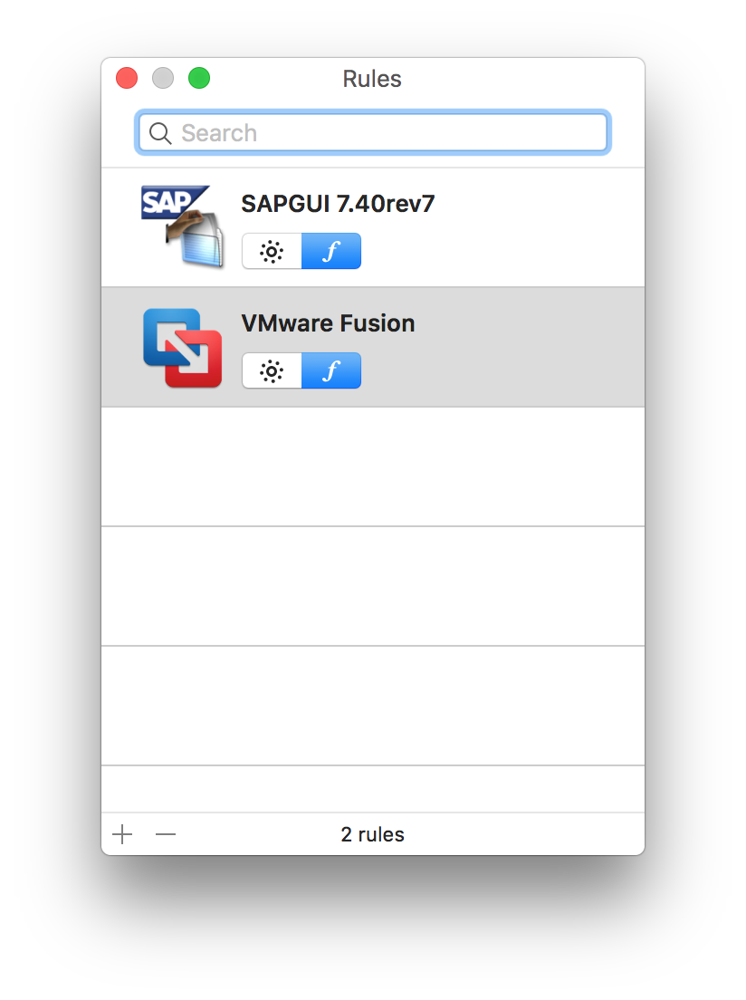
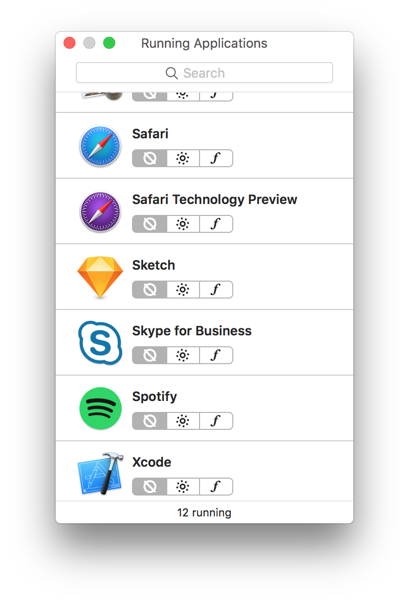

<div align="center">

  

  <h1>Fluor</h1>

  <p><strong>Make your Mac’s function keys fit the app you’re using.</strong></p>

  <p>
    A small, open-source menu bar utility for switching between media keys and<br />
    standard F1–F12 keys—automatically, per app, or with a shortcut.
  </p>

  <p>
    
    <a href="https://developer.apple.com/xcode/swift/"></a>
    <a href="LICENSE"></a>
  </p>

  <p>
    <a href="https://github.com/wiggly-sheets/fluor/releases/latest"><strong>Download</strong></a>
    &nbsp;·&nbsp;
    <a href="#how-it-works">How it works</a>
    &nbsp;·&nbsp;
    <a href="#macos-26">macOS 26</a>
    &nbsp;·&nbsp;
    <a href="#open-source">Contribute</a>
  </p>

  

</div>

---

Fluor keeps the top row of your keyboard in the mode that makes sense for the app in front of you. Use media controls everywhere, use F1–F12 everywhere, or let Fluor choose on an app-by-app basis.

## Features

- **Two keyboard modes** — switch between media-key behavior and standard function keys.
- **Per-app rules** — give an app its own behavior, while unconfigured apps follow your default.
- **A clear menu bar indicator** — see the active mode at a glance and change it from the menu.
- **Configurable global shortcut** — toggle modes from any app. The default shortcut is <kbd>⌃⌥⌘F</kbd>, and it can be replaced or cleared in **Settings → General**.
- **Flexible triggering** — switch by active window, the Fn key, or a hybrid of both.
- **Lightweight controls** — configure launch at login, notifications, menu-bar appearance, and whether the menu-bar item is shown.

## How it works

<div align="center">
  
</div>

Fluor lives in the menu bar. Its icon reflects the current keyboard mode, and its menu lets you change the default behavior, open Settings, edit rules, or temporarily disable Fluor. When disabled, Fluor restores the keyboard behavior it found when it launched.

### Rules

<div align="center">
  
</div>

Rules let you set a mode for an individual app. Add an application, choose its behavior, and Fluor applies it when that app becomes active. Apps without a rule inherit the default mode.

For processes that are difficult to select in the Rules window, **Running Applications** lets you create the same rule from the apps currently open on your Mac.

<div align="center">
  
</div>

## macOS 26

Fluor targets macOS 26 and later. It uses the current macOS keyboard preference and asks the system to apply mode changes; the legacy `IOHIDSystem` write path has been removed. Launch at login uses Apple’s native `SMAppService` API.

The configurable global shortcut requires **Accessibility** permission. Open **Settings → Advanced**, select **Grant Access…**, enable Fluor in System Settings, then return to Fluor. Permission is not required when you only use window-based switching.

## Install

Download the latest `Fluor.dmg` from [GitHub Releases](https://github.com/wiggly-sheets/fluor/releases/latest), open it, and drag Fluor to Applications. The current community build is ad-hoc signed rather than notarized, so on first launch you may need to Control-click Fluor in Finder and choose **Open**.

## Build and install from source

To build and install Fluor yourself, you need:

- macOS 26 or later
- Xcode 26
- An Apple Silicon or Intel Mac

Clone the repository, open the project, and run the **Fluor** scheme:

```bash
git clone https://github.com/wiggly-sheets/fluor.git
cd fluor
open Fluor.xcodeproj
```

You can also build from Terminal:

```bash
xcodebuild -project Fluor.xcodeproj -scheme Fluor -configuration Release build
```

Copy the resulting `Fluor.app` to `/Applications`. Locally built copies are ad-hoc signed, so macOS may ask you to open the app once with Finder’s **Open** command.

The project builds for Apple Silicon and Intel. In Xcode, select the **Fluor** scheme and press <kbd>⌘R</kbd> to run a Debug build, or use the Release command above. The Sparkle updater has been removed, so updating a locally built copy means rebuilding and replacing the app in `/Applications`.

## Open source

Fluor began as a small utility to make the keyboard behave the way its author needed: simple, thoughtfully designed, free, and useful to anyone with the same need. It remains open source so its behavior can be inspected, improved, and shared.

Contributions are welcome—fork it, hack on it, and open a pull request.

Original Fluor by [Pierre Tacchi (Pyroh)](https://github.com/Pyroh/Fluor).

## License

Fluor is released under the [MIT License](LICENSE).
